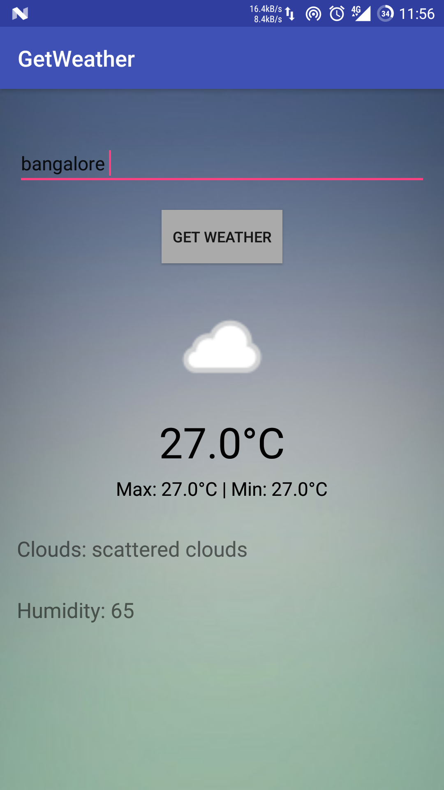

# GetWeather
This app will tell you the current temperature, maximum and minimum temperature and few other weather details.
The app was developed with android studio using async task to get weather info from a site.
 

</img>

